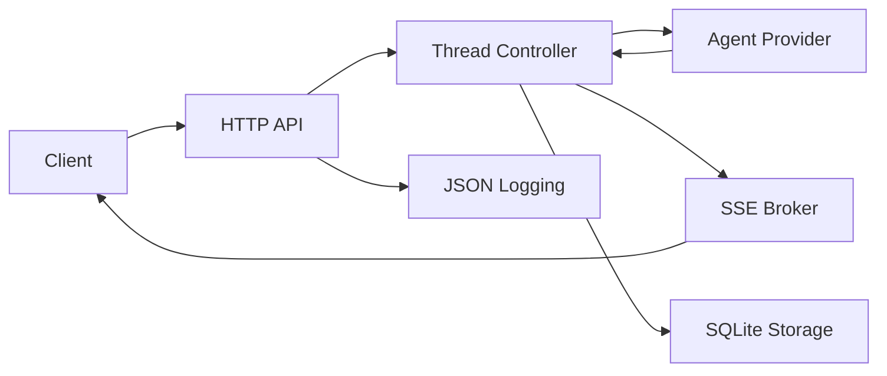

# ARCHITECTURE

## Module Graph

## Runtime Model

### Thread Controller

- Owns thread-level state machine.
- Ensures only one active turn per thread.
- Creates cancel context for each turn.
- Persists state transitions and emitted events.

### Agent Lifecycle

- Lazy creation on first thread activity.
- Provider abstraction hides fake/acp/codex implementations.
- Turn execution consumes input and emits structured events.
- Crash/exit maps to terminal failure event.

### Permission Wait Path

1. provider emits `permission_required`.
2. runtime stores event and notifies clients.
3. runtime blocks turn until decision.
4. decision endpoint resolves wait channel.
5. timeout or invalid response defaults to deny.

### SSE Delivery

- SSE broker subscribes thread observers.
- stream includes new events and optional replay from `since` sequence.
- disconnect/reconnect relies on persisted event history.

### Shutdown Behavior (Target)

- stop accepting new turns.
- cancel active operations.
- persist terminal/interrupted states.
- close providers and storage gracefully.
